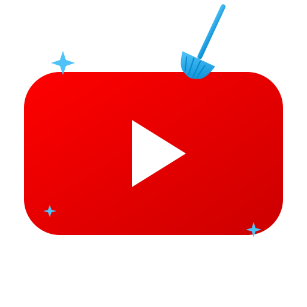

<p align="center">
  
</p>

<h1 align="center">YouTube Cleaner</h1>

<p align="center">
  A web application to clean up your YouTube account — manage subscriptions, playlists, and uploaded videos in one place.
</p>

<p align="center">
  <a href="#features">Features</a> •
  <a href="#quick-start">Quick Start</a> •
  <a href="#development-guide">Dev Guide</a> •
  <a href="#chrome-web-store-submission">Chrome Web Store</a> •
  <a href="#contributing">Contributing</a>
</p>

---

## Features

- **🧹 Bulk Unsubscribe** — Review and unsubscribe from channels you no longer watch
- **📋 Playlist Management** — View, organize, and delete playlists
- **🎬 Video Management** — Browse and delete your uploaded videos
- **📊 Dashboard** — See an overview of your YouTube account statistics
- **🔒 Secure** — OAuth2 authentication with Google; no passwords stored
- **🐳 Docker Ready** — Run anywhere with a single `docker compose up`

## Architecture

```
                  ┌──────────────┐
                  │   Browser    │
                  └──────┬───────┘
                         │ HTTP
                  ┌──────▼───────┐
                  │  Go Server   │
                  │  (net/http)  │
                  └──────┬───────┘
                         │
          ┌──────────────┼──────────────┐
          │              │              │
   ┌──────▼──────┐ ┌─────▼─────┐ ┌─────▼──────┐
   │  Handlers   │ │ Templates │ │  Static    │
   │  (API +     │ │ (HTML)    │ │  (CSS/JS/  │
   │   pages)    │ │           │ │   icons)   │
   └──────┬──────┘ └───────────┘ └────────────┘
          │
   ┌──────▼──────┐
   │  YouTube    │
   │  API Client │──── OAuth2 ──── Google
   └─────────────┘
```

The server authenticates users via Google OAuth2, then uses the YouTube Data API v3 to list and manage the user's subscriptions, playlists, and uploaded videos. Sessions are stored in-memory with HTTP-only cookies.

## Quick Start

### Prerequisites

- [Go 1.23+](https://go.dev/dl/) (or [Docker](https://docs.docker.com/get-docker/))
- A [Google Cloud project](https://console.cloud.google.com/) with the **YouTube Data API v3** enabled
- OAuth2 credentials (Client ID and Client Secret)

### 1. Set Up Google OAuth2

1. Go to the [Google Cloud Console](https://console.cloud.google.com/)
2. Create a new project (or select an existing one)
3. Navigate to **APIs & Services → Library**
4. Search for **YouTube Data API v3** and click **Enable**
5. Go to **APIs & Services → Credentials**
6. Click **Create Credentials → OAuth 2.0 Client ID**
7. Select **Web application** as the application type
8. Under **Authorized redirect URIs**, add:
   ```
   http://localhost:8080/auth/callback
   ```
9. Copy the **Client ID** and **Client Secret**

### 2. Configure Environment

Create a `.env` file in the project root (it's git-ignored):

```bash
YOUTUBE_CLIENT_ID="your-client-id"
YOUTUBE_CLIENT_SECRET="your-client-secret"
YOUTUBE_REDIRECT_URL="http://localhost:8080/auth/callback"  # optional, this is the default
```

Or export them directly:

```bash
export YOUTUBE_CLIENT_ID="your-client-id"
export YOUTUBE_CLIENT_SECRET="your-client-secret"
```

### 3. Run

**With Go:**

```bash
make run
```

**With Docker:**

```bash
docker compose up
```

Then open [http://localhost:8080](http://localhost:8080) in your browser.

---

## Development Guide

### Project Structure

```
youtube-cleaner/
├── cmd/server/              # Application entry point
│   └── main.go              #   HTTP server bootstrap
├── internal/
│   ├── handlers/            # HTTP request handlers
│   │   ├── handlers.go      #   Routes, auth middleware, API endpoints
│   │   └── handlers_test.go #   Handler unit tests
│   ├── models/              # Data models
│   │   └── models.go        #   Video, Subscription, Playlist, Stats types
│   └── youtube/             # YouTube API client & OAuth2
│       ├── auth.go          #   OAuth2 config & CSRF state tokens
│       ├── auth_test.go     #   Auth unit tests
│       └── client.go        #   YouTube Data API v3 wrapper
├── static/                  # Static assets served at /static/
│   ├── icon.svg             #   Application icon (512×512)
│   ├── favicon.svg          #   Browser tab icon (32×32)
│   ├── style.css            #   Responsive CSS with YouTube-inspired theme
│   └── app.js               #   Client-side JS for API calls & toast notifications
├── templates/               # Go html/template files
│   ├── index.html           #   Landing page with OAuth sign-in
│   ├── dashboard.html       #   Account stats overview
│   ├── subscriptions.html   #   Subscription management grid
│   ├── playlists.html       #   Playlist management grid
│   └── videos.html          #   Video management grid
├── .github/workflows/       # CI/CD
│   └── ci.yml               #   PR checks: lint, test, build
├── Dockerfile               # Multi-stage Docker build
├── docker-compose.yml       # Docker Compose configuration
├── Makefile                 # Build automation
├── go.mod                   # Go module dependencies
├── go.sum                   # Dependency checksums
└── .gitignore               # Git ignore rules
```

### Setting Up Your Dev Environment

1. **Clone the repository:**

   ```bash
   git clone https://github.com/mbergo/youtube-cleaner.git
   cd youtube-cleaner
   ```

2. **Install Go** (1.23 or later) — [download here](https://go.dev/dl/). Verify with:

   ```bash
   go version
   ```

3. **Download dependencies:**

   ```bash
   make deps
   ```

4. **Set up environment variables** (see [Quick Start](#2-configure-environment) above).

5. **Run the development server:**

   ```bash
   make run
   ```

   The server starts at `http://localhost:8080` by default.

6. **Run all checks before committing:**

   ```bash
   make lint test build
   ```

### Make Targets

Run `make help` to see all available targets:

| Command | Description |
|---|---|
| **Go** | |
| `make help` | Show all available targets |
| `make deps` | Download Go module dependencies |
| `make build` | Compile the binary to `bin/youtube-cleaner` |
| `make run` | Build and run the server locally |
| `make test` | Run all tests with race detector |
| `make test-cover` | Run tests and generate coverage report |
| `make lint` | Run all linters (`go vet` + format check) |
| `make vet` | Run `go vet` static analysis |
| `make fmt` | Check code formatting (fails if files need `gofmt`) |
| `make tidy` | Tidy `go.mod` and `go.sum` |
| `make clean` | Remove build artifacts and coverage files |
| **Docker** | |
| `make docker-build` | Build the Docker image |
| `make docker-run` | Build image and run container directly |
| `make docker-up` | Start services with Docker Compose (foreground) |
| `make docker-up-d` | Start services with Docker Compose (background) |
| `make docker-down` | Stop Docker Compose services |
| `make docker-logs` | Follow Docker Compose logs |
| `make docker-clean` | Stop services and remove images/volumes |

### Running Tests

```bash
# Run all tests with verbose output and race detection
make test

# Run tests with coverage report
make test-cover

# Run tests for a specific package
go test ./internal/handlers/ -v

# Run a specific test
go test ./internal/youtube/ -run TestGenerateStateToken -v
```

### Code Structure

**Routes** (registered in `internal/handlers/handlers.go`):

| Method | Path | Auth | Description |
|---|---|---|---|
| `GET` | `/` | No | Landing page |
| `GET` | `/auth/login` | No | Starts OAuth2 flow |
| `GET` | `/auth/callback` | No | OAuth2 callback |
| `GET` | `/auth/logout` | No | Clears session |
| `GET` | `/dashboard` | Yes | Account statistics |
| `GET` | `/subscriptions` | Yes | List subscriptions |
| `GET` | `/playlists` | Yes | List playlists |
| `GET` | `/videos` | Yes | List uploaded videos |
| `POST` | `/api/unsubscribe` | Yes | Unsubscribe from channel |
| `POST` | `/api/delete-playlist` | Yes | Delete a playlist |
| `POST` | `/api/delete-video` | Yes | Delete a video |
| `POST` | `/api/remove-playlist-item` | Yes | Remove item from playlist |

**API endpoints** accept JSON: `{ "id": "<resource-id>" }` and return `{ "status": "ok" }` on success.

### Docker Development

All Docker operations are available via Make targets:

```bash
# Build and start (foreground)
make docker-up

# Build and start (background)
make docker-up-d

# View logs
make docker-logs

# Stop
make docker-down

# Stop and remove images/volumes
make docker-clean

# Or run a one-off container directly (no Compose)
make docker-run
```

The Dockerfile uses a multi-stage build: Go 1.23 Alpine for compilation, Alpine 3.20 for the runtime image.

### Environment Variables

| Variable | Required | Default | Description |
|---|---|---|---|
| `YOUTUBE_CLIENT_ID` | Yes | — | Google OAuth2 Client ID |
| `YOUTUBE_CLIENT_SECRET` | Yes | — | Google OAuth2 Client Secret |
| `YOUTUBE_REDIRECT_URL` | No | `http://localhost:8080/auth/callback` | OAuth2 redirect URI |
| `PORT` | No | `8080` | Server port |
| `TEMPLATE_DIR` | No | `templates` | Path to HTML templates |
| `STATIC_DIR` | No | `static` | Path to static assets |

---

## Chrome Web Store Submission

> **Note:** YouTube Cleaner is currently a standalone web application. To publish it on the Chrome Web Store, you need to package it as a Chrome Extension. The steps below walk you through the full process.

### Step 1: Prepare Your Extension Package

1. **Create a `manifest.json`** in a new `extension/` directory:

   ```json
   {
     "manifest_version": 3,
     "name": "YouTube Cleaner",
     "version": "1.0.0",
     "description": "Clean up your YouTube account — manage subscriptions, playlists, and uploaded videos.",
     "permissions": ["identity"],
     "icons": {
       "16": "icons/icon-16.png",
       "48": "icons/icon-48.png",
       "128": "icons/icon-128.png"
     },
     "action": {
       "default_popup": "popup.html",
       "default_icon": "icons/icon-48.png"
     },
     "oauth2": {
       "client_id": "YOUR_CLIENT_ID.apps.googleusercontent.com",
       "scopes": [
         "https://www.googleapis.com/auth/youtube",
         "https://www.googleapis.com/auth/youtube.force-ssl"
       ]
     }
   }
   ```

2. **Convert your SVG icons to PNG** at sizes 16×16, 48×48, and 128×128 and place them in `extension/icons/`.

3. **Create the extension popup and scripts** that communicate with the YouTube Data API v3 directly from the browser (using `chrome.identity` for OAuth2).

### Step 2: Register as a Chrome Web Store Developer

1. Go to the [Chrome Web Store Developer Dashboard](https://chrome.google.com/webstore/devconsole)
2. Pay the one-time **$5 registration fee**
3. Complete your developer profile (display name, email, etc.)

### Step 3: Submit Your Extension

1. **Zip your extension directory:**

   ```bash
   cd extension
   zip -r ../youtube-cleaner-extension.zip .
   ```

2. Go to the [Developer Dashboard](https://chrome.google.com/webstore/devconsole)
3. Click **New Item** and upload `youtube-cleaner-extension.zip`
4. Fill out the listing information:
   - **Description** — Explain what the extension does
   - **Screenshots** — At least one 1280×800 or 640×400 screenshot
   - **Category** — Productivity
   - **Language** — English
5. Set the **Privacy Practices**:
   - Declare that you use the YouTube API (user data access)
   - Provide a privacy policy URL
   - Justify each permission requested
6. Click **Submit for Review**

### Step 4: Review Process

- Google reviews all extensions before publishing (typically 1–3 business days)
- You may receive feedback requesting changes — address any issues and resubmit
- Once approved, the extension appears in the Chrome Web Store

### Additional Requirements for YouTube API

- Your Google Cloud project must have the YouTube Data API v3 enabled
- Your OAuth consent screen must be configured and, for public use, **verified by Google**
- You must comply with the [YouTube API Terms of Service](https://developers.google.com/youtube/terms/api-services-terms-of-service)
- You need a published [Privacy Policy](https://developers.google.com/youtube/terms/developer-policies#d.-privacy) that discloses YouTube API usage

---

## CI/CD

Pull requests targeting `main` automatically run the following checks via GitHub Actions:

- **Lint** — `go vet ./...` to catch common issues
- **Test** — `go test ./... -race` with race condition detection
- **Build** — Ensures the binary compiles successfully

See [`.github/workflows/ci.yml`](.github/workflows/ci.yml) for the full workflow configuration.

---

## Contributing

1. Fork the repository
2. Create a feature branch: `git checkout -b my-feature`
3. Make your changes and add tests
4. Run checks locally:
   ```bash
   make lint
   make test
   make build
   ```
5. Commit and push: `git push origin my-feature`
6. Open a pull request against `main`

All PRs must pass the CI checks (lint, test, build) before merging.

## License

MIT